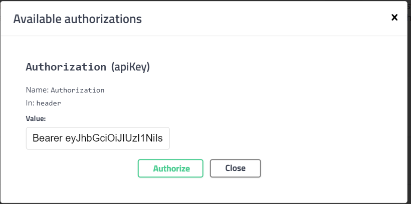

# Инструкция по скачиванию и запуску Spring проекта

Этот репозиторий содержит bash-скрипт, который автоматизирует процесс сборки и запуска Spring проекта. Вы можете
использовать этот скрипт для упрощения разработки и тестирования ваших Spring Boot приложений.

## Шаг 1: Установка

1.1. Клонируйте репозиторий на вашем локальном компьютере с помощью Git:

```bash
git clone -b java https://github.com/X-MARIO/OC.git
```

1.2. Перейди в папку проекта

```bash
cd OC
```

1.3. Убедитесь, что у скрипта есть права на выполнение:

```bash
chmod +x build.sh
```

1.4

```bash
./build.sh
```

# Подключение базы данных

В данном проекте доступна база данных H2, которую можно использовать в вашем проекте(она встроенная, не требует
установки)

Для доступа к базе данных нужно перейти по адресу:

```http
http://localhost:8888/h2-console
```

Возможно потребуется ввести url базы данных для подключения для этого введите данные как на скриншоте:


```plaintext
Driver Class: org.h2.Driver
JDBC URL: jdbc:h2:mem:testdb
User Name: sa
```

## Авторизация

Заранее созданы два пользователя:
username: pasha , password: password (ROLE_ADMIN, ROLE_USER)
username: maxim , password: pwd1 (ROLE_USER)

## Поддержка Swagger UI

Этот проект включает поддержку Swagger UI, который предоставляет интерфейс для документации и тестирования API.


### Как перейти к Swagger UI

1. Запустите приложение.

2. Откройте веб-браузер и перейдите по следующему адресу:

```plaintext
http://localhost:8888/swagger-ui.html
```

3. Для некоторых методов требуется авторизация, поэтому необходимо получить токен ('/userDBS/login') и нажать кнопку '
   Authorize':


4. Далее важно не забыть написать Bearer и вставить полученный токен. После этого будет получен доступ к авторизованным
эндпоинтам.



# REST API для системных вызовов Linux

Этот REST API предоставляет возможность получать данные о системе линукс

## Получение всех процессов Linux

```http
GET http://localhost:8888/api/processes
```

Пример успешного ответа:
status : 200 (OK)

```json
[
   {"userDB":"root",
   "pid":1,"cpuUsage":0.3,
   "memoryUsage":0.3,"vsz":168204,
   "rss":7924,
   "tty":"?",
   "stat":"Ss",
   "start":"09:50",
   "time":"0:02",
   "command":"/sbin/init"},
   ......
]
